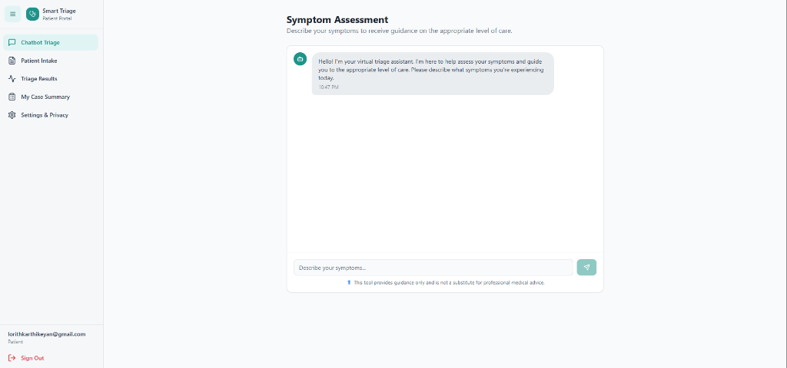

# 🏥 Care Compass
### AI-Powered Healthcare Triage & Resource Management System


*(Placeholder image - replace with a screenshot of your dashboard!)*

## 🚨 The Problem
Emergency departments are overwhelmed. With rising patient volumes and limited staff, **wait times increase**, **staff burnout peaks**, and critical "golden hour" moments for patient care are lost in the chaos. Triage nurses are forced to make high-stakes decisions with limited data and immense pressure.

## 💡 The Solution
**Care Compass** is an intelligent operational platform designed to streamline emergency intake, prioritize cases dynamically, and optimize resource allocation in real-time. It acts as a force multiplier for healthcare staff, ensuring the right patient gets the right care at the right time.

## ✨ Key Features

### 🤖 AI-Driven Patient Intake via Chatbot
*   **`ChatbotTriage.tsx`**: An intelligent conversational interface that performs initial symptom assessment.
*   collects history and vitals before the patient even sees a nurse.
*   reduces intake administrative time by up to 40%.

### ⚡ Smart Priority Queue
*   **`PriorityQueue.tsx`**: A dynamic, algorithmic queue that updates in real-time.
*   Sorts patients not just by arrival time, but by medical urgency (ESI levels).
*   **`AlertsFlags.tsx`**: Automatic flagging of deteriorating conditions or sepsis risks.

### 📋 Comprehensive Case Management
*   **`CaseSummary.tsx` & `PatientCases.tsx`**: AI-generated summaries of patient history.
*   Provides clinicians with a "30-second snapshot" of complex cases.
*   **`TriageResults.tsx`**: Instant visualization of triage scores and recommended actions.

### 📊 Operational Analytics & Workload Balancing
*   **`WorkloadAnalytics.tsx`**: Real-time dashboards showing ED capacity and staff load.
*   Predictive analytics to foresee bottlenecks before they happen.

## 🛠️ Tech Stack

*   **Frontend**: React (Vite), TypeScript
*   **Styling**: Tailwind CSS, shadcn/ui (Radix UI)
*   **Charts/Visuals**: Recharts
*   **State/Data**: React Query, Supabase (Integration)
*   **Routing**: React Router

## 🚀 Getting Started

1.  **Clone the Repository**
    ```bash
    git clone https://github.com/Mirudhula24/care-compass.git
    cd care-compass
    ```

2.  **Install Dependencies**
    ```bash
    npm install
    ```

3.  **Run Locally**
    ```bash
    npm run dev
    ```
    Open `http://localhost:8080` to view the dashboard.

## 🔮 Future Roadmap
*   **Wearable Integration**: Direct feed from Apple Watch/Fitbi vitals during waiting.
*   **Bed Management**: Automated bed assignment based on discharge predictions.
*   **Multi-Language Support**: Real-time translation for non-English speaking patients.

---

Made with ❤️ by the **Care Compass Team** for **Project Day 2026**
